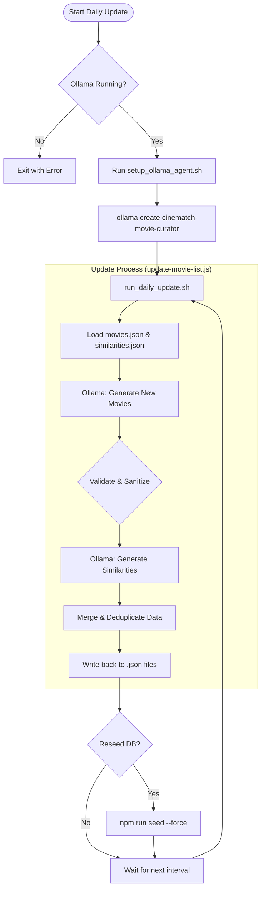

# CineMatch - Movie Recommendation System

A full-stack movie recommendation web application with personalized suggestions based on user ratings, favorites, and viewing preferences.

## Tech Stack

- **Frontend:** React 18 + Vite + React Router
- **Backend:** Node.js + Express
- **Database:** SQLite (via sql.js)
- **Auth:** JWT + bcryptjs

## Getting Started

### Prerequisites

- Node.js 18+

### Installation

```bash
# Install backend dependencies
cd backend
npm install

# Seed the database
npm run seed

# Install frontend dependencies
cd ../frontend
npm install
```

### Running the Application

Start both servers (in separate terminals):

```bash
# Terminal 1: Backend (runs on port 3001)
cd backend
npm run dev

# Terminal 2: Frontend (runs on port 5173)
cd frontend
npm run dev
```

Visit **http://localhost:5173** in your browser.

### Demo Account

- **Username:** `demo`
- **Password:** `Password123`

## Features

- **User Registration & Authentication** - Secure sign up/sign in with password validation
- **Movie Browsing** - Browse 40+ movies with poster images and details
- **Search & Filter** - Search by title/director, filter by genre, sort by year/rating
- **Movie Details** - View full movie info, average ratings, and user comments
- **Rate Movies** - 1-5 star rating system with live average updates
- **Favorites** - Add/remove movies from your favorites list
- **Comments** - Post and manage comments on movies
- **Personalized Recommendations** - Hybrid engine using:
  - Content-based filtering (genre preferences from ratings/favorites)
  - Collaborative filtering (cosine similarity between users)
- **User Profile** - View stats, manage preferred genres, see favorites and ratings

## AI Automation (Ollama Agent)

The system includes an automated movie curator powered by Ollama to periodically expand the movie database with new content and similarity links.

### Agent Control Flow



### Usage

To manually trigger the AI curator and add a specific number of movies:

```bash
# From the backend directory
npm run ollama:run -- --once --count <number>
```

- `--once`: Runs a single update cycle and exits.
- `--count <number>`: Specifies how many unique movies to add (default: 5, max: 25).

## API Endpoints

| Method | Endpoint | Description |
|--------|----------|-------------|
| POST | `/api/auth/register` | Register new user |
| POST | `/api/auth/login` | Login |
| GET | `/api/auth/me` | Get current user profile |
| PUT | `/api/auth/me` | Update profile |
| GET | `/api/movies` | List movies (search, filter, paginate) |
| GET | `/api/movies/genres` | List all genres |
| GET | `/api/movies/popular` | Get popular movies |
| GET | `/api/movies/:id` | Get movie details |
| POST | `/api/interactions/rate` | Rate a movie |
| POST | `/api/interactions/favorite` | Toggle favorite |
| POST | `/api/interactions/comment` | Add comment |
| DELETE | `/api/interactions/comment/:id` | Delete comment |
| GET | `/api/interactions/favorites` | Get user favorites |
| GET | `/api/interactions/ratings` | Get user ratings |
| GET | `/api/recommendations` | Get personalized recommendations |

```text
movie-recommendation-app/
├── backend/                    # Node.js/Express API server
│   ├── src/
│   │   ├── server.js          # Main entry point (port 3001)
│   │   ├── db/
│   │   │   ├── database.js    # SQLite wrapper (sql.js)
│   │   │   ├── schema.js      # Database schema & initialization
│   │   │   └── seed.js        # Database seeding with 40+ movies
│   │   ├── routes/
│   │   │   ├── auth.js        # User registration & login
│   │   │   ├── movies.js      # Movie listing & search
│   │   │   ├── interactions.js # Ratings, favorites, comments
│   │   │   └── recommendations.js # Recommendation algorithm
│   │   └── middleware/
│   │       └── auth.js        # JWT authentication
│   └── package.json
├── frontend/                   # React 18 + Vite UI
│   ├── src/
│   │   ├── pages/            # Home, Movies, MovieDetail, Profile, Login, Register
│   │   ├── components/       # MovieCard, StarRating, Navbar
│   │   ├── context/          # AuthContext for state management
│   │   ├── api/              # API client
│   │   └── main.jsx
│   └── vite.config.js
└── README.md
```

## Daily Movie List Updates with Ollama

The backend includes an Ollama-powered updater that refreshes both `backend/src/db/movies.json` and `backend/src/db/similarities.json` every day, then re-seeds the SQLite database from those JSON sources.

### Included files

- `backend/ollama/Modelfile` - required model definition for the movie-curation agent.
- `backend/scripts/ollama/setup_ollama_agent.sh` - builds the Ollama model locally.
- `backend/scripts/ollama/run_daily_update.sh` - runs the update once or on a daily loop.
- `backend/scripts/ollama/update-movie-list.js` - Node.js updater that validates/merges generated movies and generated similarity pairs.

### Setup

```bash
cd backend
npm run ollama:setup
```

### Run once

```bash
cd backend
npm run ollama:run -- --once
```

### Run continuously (daily)

```bash
cd backend
npm run ollama:run
```

Optional environment variables:

- `OLLAMA_MODEL` (default: `cinematch-movie-curator`)
- `MOVIE_COUNT` (default: `5`)
- `INTERVAL_SECONDS` (default: `86400`)
- `RESEED_AFTER_UPDATE` (default: `true`, runs `npm run seed -- --force` after each update cycle)


### Run updater without reseeding DB

```bash
cd backend
RESEED_AFTER_UPDATE=false npm run ollama:run -- --once
```

## Poster URL Repair

Fixes missing or broken poster URLs in `movies.json` using the DuckDuckGo Instant Answer API (no API key required). Also removes duplicate movie entries.

```bash
cd backend

# Preview changes without writing
npm run fix:posters -- --dry-run

# Apply fixes and save
npm run fix:posters
```

After running, re-seed the database to apply changes:

```bash
npm run seed:force
```
